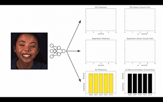

# BigSmall
BigSmall: Efficient Multi-Task Learning for Disparate Spatial and Temporal Physiological Measurements

[Pre-print](https://arxiv.org/abs/2303.11573) | [Project Website](https://girishvn.github.io/BigSmall/)

# Abstract
Understanding of human visual perception has historically inspired the design of computer vision 
architectures. As an example, perception occurs at different scales both spatially and temporally, 
suggesting that the extraction of salient visual information may be made more effective by paying 
attention to specific features at varying scales. Visual changes in the body due to physiological 
processes also occur at different scales and with modality-specific characteristic properties. 
Inspired by this, we present BigSmall, an efficient architecture for physiological and behavioral measurement. 

We present the first joint camera-based facial action, cardiac, and pulmonary measurement model. 
We propose a multi-branch network with wrapping temporal shift modules that yields both accuracy 
and efficiency gains. We observe that fusing low-level features leads to suboptimal performance, 
but that fusing high level features enables efficiency gains with negligible loss in accuracy. 
Experimental results demonstrate that BigSmall significantly reduces the computational costs. 
Furthermore, compared to existing task-specific models, BigSmall achieves comparable or better 
results on multiple physiological measurement tasks simultaneously with a unified model.

# About The Code Base
This Code base was adapted from rPPG-Toolbox (https://github.com/ubicomplab/rPPG-Toolbox). All code for dataset preprocessing, training, evaluation, model architectures, and pretrained models may be found in the `./code` directory.
The code has a seperate ReadMe w/ a more comprehensive explanation of how to use/run the software. 

# Citation: 
Links to our paper and citations will be added soon. Please make sure to cite our work if you find it of use. Thanks!

# About The Website
A website for this work, including an overview of the paper and links to the paper can be found at: 
`https://girishvn.github.io/BigSmall/`

Code for this can be found in `index.html` and `./static`. This code was adapted from 
`https://github.com/nerfies/nerfies.github.io`

